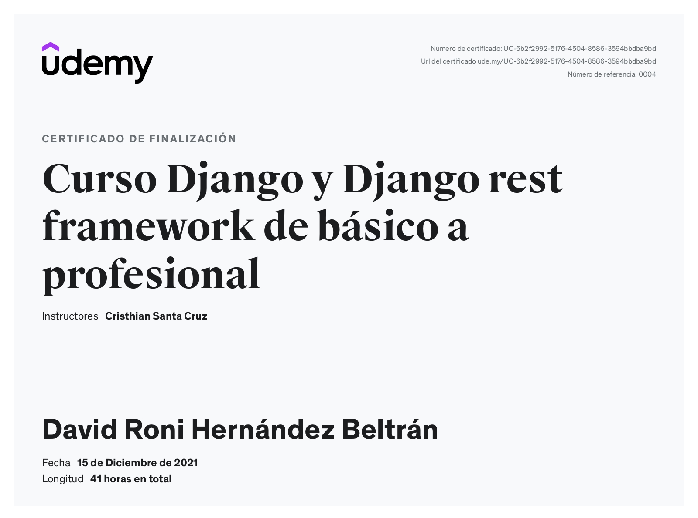
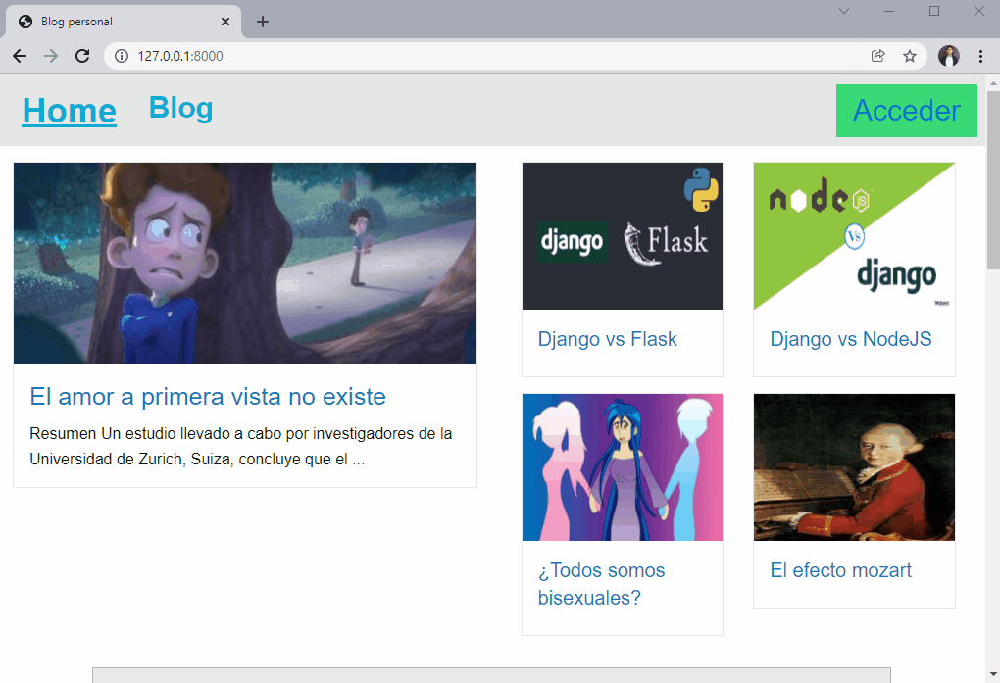

# **Blog con Django**
#### **Proyecto desarrollado en el curso de UDEMY cuyo nombre es: Django y Django rest framework de básico a profesional de:Cristhian Santa Cruz Programador Full Stack**

A continuación adjunto el certificado que obtuve tras finalizar el grandioso curso de 41 horas de video.

## **Menu**

* [1) Descripccion del proyecto](#1-descripccion-del-proyecto)
    * [1.1) Breve visualizacion del proyecto](#11-breve-visualizacion-del-proyecto)
    * [1.2) Conocimientos puestos en practica](#12-conocimientos-puestos-en-practica)

* [2) Funcionamiento del proyecto](#2-funcionamiento-del-proyecto)
    * [2.1) Ver los articulos registrados](#21-ver-los-articulos-registrados)
    * [2.2) Suscripccion y formulario de contacto](#22-suscripccion-y-formulario-de-contacto)

    * [2.3) Registrarse](#23-registrarse)
    * [2.4) Perfil del usuario](#24-perfil-del-usuario)
    * [2.5) Cambiar datos de la pagina principal](#25-cambiar-datos-de-la-pagina-principal)
    * [2.6) Registrar un articulo en el blog](#26-registrar-un-articulo-en-el-blog)

## **1) Descripccion del proyecto**

[Regresar al menu principal](#menu)

Antes de cualquier cosa es necesario partir de la siguiente preguntar ¿que es un blog? a continuación adjunto algunas respuestas encontradas en internet:

* Un blog es una página web en la que se publican regularmente artículos cortos con contenido actualizado y novedoso sobre temas específicos o libres.Los artículos de un blog suelen estar acompañados de fotografías, videos, sonidos y hasta de animaciones y gráficas que ilustran mucho mejor el tema tratado.

Una vez aclarado que es un blog procesedere a explicar que es lo que hace este proyecto:

Este proyecto es un blog, por lo tanto este proyecto permite agregar articulos desde el sitio de administración de Django con ayuda de ckeditor. Este proyecto permite a los usuarios registrarse e iniciar sesión ya que este proyecto les ofrece un perfil a cada usuario que se registre, el objetivo de que cada usuario tenga perfil es por que podran administrar una lista de articulos favoritos en donde podran almacenar los articulos que  mas interesantes les parezcan o eliminar de ella los articulos que ya no les parezcan interesantes.

### **1.1) Breve visualizacion del proyecto**

[Regresar al menu principal](#menu)

### **1.2) Conocimientos puestos en practica**

[Regresar al menu principal](#menu)

* Una buena organización de codigo en proyectos de Django
* El uso de diferentes vistas tales como: TemplateView,ListView,DetailView,UpdateView,DeleteView,View
* El uso de managers
* El uso de  formularios en Django
* La creación de diferentes Apps asi como tambien la creación de modelos.
* El uso de: **LoginRequiredMixin** para restringir el acceso a determinadas vistas si no cumplen con los permisos o el usuario no ha inciado sesion
* El uso de sesiones y registros de usuarios.
* El uso de: PostgreSQL como sistema de gestión de bases de datos 
* La integracion de Ckeditor con Django
* El uso de: Foundation como framework de interfaz de usuario
* El almacenamiento de contenido media.
* El constante uso del sitio de administración de Django

## **2) Funcionamiento del proyecto**

[Regresar al menu principal](#menu)

### **2.1)  Ver los articulos registrados**

[Regresar al menu principal](#menu)

Los articulos de podran apreciar en diferentes apartados:

* En la pagina principal del sitio web se podran ver los articulos, es decir al dar  clic izquierdo sobre: **"Home"** el cual se encuentra en el encabezado se podran apreciar los articulos, para ver su contenido bastara con dar clic izquierdo sobre el titulo del articulo

* Al dar  clic izquierdo sobre: **"Blog"** el cual se encuentra en el encabezado se podran apreciar los articulos y tambien si se desea se pueden buscar por categoria o por palabra clave.Para ver el contenido de un articulo  bastara con dar clic izquierdo sobre el titulo del articulo

Es importante mencionar que los usuarios que no inicien sesión no podran: **agregar como favoritos a los articulos que quieran** ya que para hacer ello deben tener un perfil y haber iniciado sesión, **si se intenta agregar como favorito a un articulo** y no se ha inicado sesión, el sitio web lo dirigira al inicio de sesion.

### **2.2) Suscripccion y formulario de contacto**

[Regresar al menu principal](#menu)

* En la pagina principal del sitio web se podra ver el apartado de suscripccion, es importante mencionar que los datos de los que se se suscriban se podran ver en el sitio de administracion de Django

* El formulario de contacto se encuentra ubicado en footer del sitio web, es decir todas las paginas que se abran del sitio web en la parte inferior podran ver el formulario de contacto, es importante mencionar que los datos que manden los que contesten el formulario de contacto, podran verse en el sitio de administracion de Django

### **2.3) Registrarse**

[Regresar al menu principal](#menu)

En el sitio web, los usuarios podran registrarse e iniciar sesión con la finalidad de que puedan agregar como favoritos los articulos que deseen, para registrarse los usuarios deberan hacer lo siguiente:

### **2.4) Perfil del usuario**

[Regresar al menu principal](#menu)

Una vez registrado un usuario, dicho usuario ya podra iniciar sesión y ver su perfil en el cual podran ver sus datos personales asi como tambien podra ver una lista de articulos favoritos en la cual apareceran los articulos que haya escogido como articulos favoritos, tambien si lo desea podra eliminar articulos de dicha lista.Finalmente cuando el usuario decida podra cerrar sesión.Es importante mencionar que una de las ventajas que un usuario se registre e inicie sesion es que podra agregar a articulos como favoritos, lo cual sin iniciar sesion no es posible, en el siguiente ejemplo se ilustra lo mencionado anteriormente:

### **2.5) Cambiar datos de la pagina principal**

[Regresar al menu principal](#menu)

Los datos de contacto que aparecen en el footer del sitio web, se pueden cambiar desde el administrador de Django, tambien se puede cambiar la descripccion del proyecto desde el administrador de django.

### **2.6) Registrar un articulo en el blog**

[Regresar al menu principal](#menu)

Para registrar un articulo en el blog debera hacerse desde el sitio de administración de Django de la siguiente manera:

